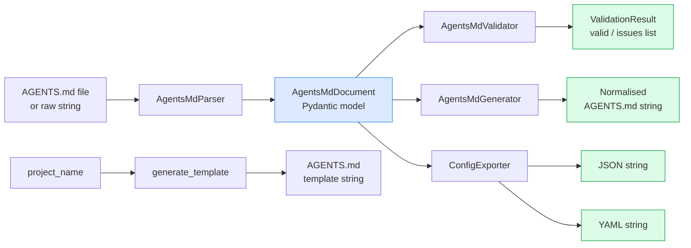

# aumai-agentsmd

Parse, validate, generate, and export AGENTS.md files — the standard for declaring AI agent capabilities and constraints.

[](https://github.com/aumai/aumai-agentsmd/actions)
[](https://pypi.org/project/aumai-agentsmd/)
[](LICENSE)
[](https://python.org)

---

## What is this?

Imagine you are hiring a contractor to renovate your home. Before they start any work, you hand them a one-page document that says: "You are allowed to renovate the kitchen and the bathroom. You must not touch the electrical panel without a licensed electrician present. You must not enter the bedrooms. Here is how we expect work to proceed: send a progress update each morning and clean up before leaving."

**AGENTS.md** is exactly that document — but for an AI agent instead of a contractor. It is a plain Markdown file that lives in a project repository and tells any AI agent (or automated tool) what it is allowed to do, what it must not do, what is in and out of scope, and how it should behave.

**aumai-agentsmd** is the reference Python implementation for reading and writing that file. It gives you:

- A parser that converts the Markdown into a structured Python object
- A validator that checks the file has all required sections
- A generator that round-trips the object back to canonical, consistently-formatted Markdown
- An exporter that converts the parsed content to JSON or YAML for downstream tooling
- A CLI with four subcommands so you can use it from a shell or CI pipeline

---

## Why does this matter?

### The problem from first principles

AI agents are increasingly deployed inside real systems — they write code, call APIs, modify files, and interact with databases. Unlike a traditional script that has a fixed, auditable list of actions, an agent can take *open-ended sequences of actions* based on a model's reasoning.

This creates two concrete problems:

1. **The agent does not know its boundaries.** Without an explicit document, the agent must infer what is in and out of scope from context. Inference is error-prone, especially at the edges of what is permitted.
2. **The human reviewer cannot audit boundaries easily.** If constraints live inside a system prompt that only the model sees, there is no single artefact a developer can open in a text editor, read, and sign off on in a code review.

AGENTS.md solves both problems: it is a first-class, version-controlled file that both the agent runtime and the human reviewer can read in the same place.

### Why a standard format?

Once a format is standard, you can build tooling around it:

- **CI/CD pipelines** can run `aumai-agentsmd validate AGENTS.md` and fail the build if the file is malformed or incomplete.
- **Configuration management** can ingest the JSON/YAML export to populate agent runtime settings automatically.
- **Policy engines** can consume the parsed document to enforce organisational rules across all agents.
- **Onboarding tooling** can `aumai-agentsmd init` to scaffold a correct file in new projects.

---

## Architecture



**Data flow:**

1. Raw AGENTS.md Markdown enters `AgentsMdParser.parse()` (string) or `parse_file()` (path).
2. A single-pass line scanner extracts headings and section bodies into typed buffers.
3. List-item regex and prose extraction produce the `AgentsMdDocument` Pydantic model.
4. `AgentsMdValidator.validate()` checks for required sections and returns a `ValidationResult`.
5. `AgentsMdGenerator.generate()` reconstructs canonical Markdown from the model.
6. `ConfigExporter.to_json()` / `to_yaml()` serialise the model for external consumers.

---

## Features

| Feature | Description |
|---|---|
| **Structured parsing** | Converts unstructured Markdown into a fully typed `AgentsMdDocument` Pydantic model |
| **Heading aliases** | `Scope` is accepted as an alias for `Scope Boundaries`; `Workflow` for `Development Workflow` |
| **Extra section preservation** | Unknown headings and their content are preserved verbatim in `extra_sections` — no data loss |
| **Five-section validation** | Checks `project_context`, `capabilities`, `constraints`, `scope_boundaries`, and `development_workflow` |
| **Structured issues** | Each validation issue carries a section enum, severity (`error`/`warning`/`info`), message, and optional line number |
| **Round-trip generation** | Parse then re-emit produces consistently formatted Markdown regardless of input style |
| **JSON export** | Pretty-printed JSON suitable for APIs, CI outputs, and log ingestion |
| **YAML export** | Human-readable YAML for configuration management pipelines |
| **Template scaffolding** | `generate_template()` and the `init` CLI command produce a correct, ready-to-edit AGENTS.md |
| **CLI** | Four subcommands: `validate`, `parse`, `generate`, `init` — colour-coded terminal output |

---

## Quick Start

### Install

```bash
pip install aumai-agentsmd
```

### Your first AGENTS.md in under 5 minutes

```bash
# Step 1 — scaffold a template
aumai-agentsmd init --project-name "My AI Agent"

# Step 2 — open the file and fill in the details
# (edit AGENTS.md in your editor)

# Step 3 — validate
aumai-agentsmd validate AGENTS.md
# AGENTS.md is valid: AGENTS.md

# Step 4 — export to JSON to verify the parsed structure
aumai-agentsmd parse AGENTS.md --output json
```

### Python in 30 seconds

```python
from aumai_agentsmd import AgentsMdParser, AgentsMdValidator

parser = AgentsMdParser()
validator = AgentsMdValidator()

doc = parser.parse_file("AGENTS.md")
result = validator.validate(doc)

print(f"Valid: {result.valid}")
print(f"Capabilities: {doc.capabilities}")
print(f"Constraints: {doc.constraints}")
```

---

## CLI Reference

All commands are under the `aumai-agentsmd` entry point. Run any command with `--help` for full option details.

### `validate AGENTS_MD`

Validate an AGENTS.md file for required sections and structure.

```bash
aumai-agentsmd validate AGENTS.md
aumai-agentsmd validate ./agents/AGENTS.md
```

Exits with code `0` on success (or warnings only). Exits with code `1` when any `error`-severity issue is found.

Sample output with issues:

```
[ERROR] capabilities: Required section 'capabilities' is missing or empty.
[WARNING] project_context (line 1): No H1 project name found; defaulted to 'Unnamed Project'.
Validation failed.
```

---

### `parse AGENTS_MD [--output FORMAT]`

Parse an AGENTS.md file and print its structured content as JSON or YAML.

```bash
# JSON (default)
aumai-agentsmd parse AGENTS.md

# YAML
aumai-agentsmd parse AGENTS.md --output yaml

# Redirect to file
aumai-agentsmd parse AGENTS.md > agent-config.json
```

| Option | Default | Description |
|---|---|---|
| `--output`, `-o` | `json` | Output format: `json` or `yaml` |

---

### `init [--project-name NAME] [--output PATH] [--force]`

Generate a template AGENTS.md for a new project.

```bash
# Scaffold in current directory
aumai-agentsmd init --project-name "OrderBot"

# Custom output path
aumai-agentsmd init --project-name "OrderBot" --output agents/AGENTS.md

# Overwrite an existing file
aumai-agentsmd init --project-name "OrderBot" --force
```

| Option | Default | Description |
|---|---|---|
| `--project-name` | `MyProject` | Name embedded in the H1 heading |
| `--output`, `-o` | `AGENTS.md` | Destination file path |
| `--force` | `False` | Overwrite if the file already exists |

---

### `generate AGENTS_MD [--output PATH]`

Round-trip parse an AGENTS.md and re-emit it as normalised, canonically formatted Markdown.

```bash
# Print to stdout
aumai-agentsmd generate AGENTS.md

# Write to a new file
aumai-agentsmd generate AGENTS.md --output AGENTS.normalised.md

# Normalise in-place
aumai-agentsmd generate AGENTS.md --output AGENTS.md
```

| Option | Default | Description |
|---|---|---|
| `--output`, `-o` | stdout | Write output to this file instead of stdout |

---

## Python API Examples

### Parse a file

```python
from aumai_agentsmd import AgentsMdParser

parser = AgentsMdParser()
doc = parser.parse_file("AGENTS.md")

print(doc.project_name)       # "My AI Agent"
print(doc.project_context)    # "Automates customer support triage."
print(doc.capabilities)       # ["Read tickets from the queue", "Classify by urgency"]
print(doc.constraints)        # ["Must not reply directly to customers"]
print(doc.scope_boundaries)   # ["In scope: ticket classification", "Out of scope: billing"]
print(doc.workflow_steps)     # ["Write a failing test", "Implement the change", ...]
print(doc.extra_sections)     # {"Custom Heading": "body text preserved verbatim"}
```

### Parse from a string

```python
from aumai_agentsmd import AgentsMdParser

markdown = """
# Support Triage Agent

## Project Context

Automates first-level triage of customer support tickets.

## Capabilities

- Read tickets from the helpdesk queue
- Classify tickets by urgency and category

## Constraints

- Must not reply directly to customers
- Must not access billing records

## Scope Boundaries

- In scope: ticket classification and routing
- Out of scope: direct customer communication

## Development Workflow

1. Write a failing test
2. Implement the change
3. Run linter and type checker
4. Open a pull request
"""

parser = AgentsMdParser()
doc = parser.parse(markdown)
print(doc.project_name)   # "Support Triage Agent"
print(len(doc.capabilities))  # 2
```

### Validate a document

```python
from aumai_agentsmd import AgentsMdParser, AgentsMdValidator

parser = AgentsMdParser()
validator = AgentsMdValidator()

doc = parser.parse_file("AGENTS.md")
result = validator.validate(doc)

if result.valid:
    print("All required sections present.")
else:
    for issue in result.issues:
        location = f" (line {issue.line_number})" if issue.line_number else ""
        print(f"[{issue.severity.upper()}] {issue.section.value}{location}: {issue.message}")
    raise SystemExit(1)
```

### Export to JSON or YAML

```python
from aumai_agentsmd import AgentsMdParser, ConfigExporter

parser = AgentsMdParser()
exporter = ConfigExporter()

doc = parser.parse_file("AGENTS.md")

json_string = exporter.to_json(doc)   # Pretty-printed JSON
yaml_string = exporter.to_yaml(doc)   # YAML

with open("agent-config.json", "w") as f:
    f.write(json_string)
```

### Build a document in code and generate Markdown

```python
from aumai_agentsmd import AgentsMdDocument, AgentsMdGenerator

doc = AgentsMdDocument(
    project_name="Pipeline Agent",
    project_context="Manages the nightly ETL pipeline.",
    capabilities=["Read from S3", "Write to Redshift", "Send Slack alerts"],
    constraints=["Must not delete source data", "Must not exceed 4-hour runtime"],
    scope_boundaries=["In scope: ETL only", "Out of scope: serving layer"],
    workflow_steps=["Validate schema", "Transform data", "Load to warehouse"],
)

generator = AgentsMdGenerator()
markdown = generator.generate(doc)
print(markdown)
```

### Generate a template

```python
from aumai_agentsmd import generate_template

template = generate_template("NewProject")
with open("AGENTS.md", "w", encoding="utf-8") as f:
    f.write(template)
```

---

## Configuration Options

All four classes (`AgentsMdParser`, `AgentsMdValidator`, `AgentsMdGenerator`, `ConfigExporter`) take no constructor arguments. Behaviour is controlled through method parameters.

### Recognised section headings

The parser maps these heading texts (case-insensitive) to canonical field names:

| Heading in file | Canonical field |
|---|---|
| `Project Context` | `project_context` |
| `Capabilities` | `capabilities` |
| `Constraints` | `constraints` |
| `Scope Boundaries` | `scope_boundaries` |
| `Scope` | `scope_boundaries` (alias) |
| `Development Workflow` | `development_workflow` |
| `Workflow` | `development_workflow` (alias) |

Any other heading text is stored in `AgentsMdDocument.extra_sections` verbatim.

### List detection

Bullet prefixes (`-`, `*`, `+`) and numbered list items (`1.`, `2.` etc.) are recognised in `capabilities`, `constraints`, `scope_boundaries`, and `development_workflow` sections. The `project_context` section is always treated as prose.

---

## How it Works

### Parsing internals

The parser is a single-pass line scanner, intentionally simple so that slightly malformed AGENTS.md files still parse gracefully rather than throwing an exception:

1. Each line is matched against `_HEADING_RE` (`^(#{1,3})\s+(.+)$`). H1–H3 headings are all detected.
2. The first H1 becomes `project_name`. All subsequent headings set `current_section`.
3. Non-heading lines are appended to the current section's line buffer.
4. After scanning, `_extract_list_items()` processes list sections and `_extract_prose()` joins prose lines with spaces.
5. Unknown heading lines go into `extra_sections` as raw text.

### Validation internals

`AgentsMdValidator` checks five `(AgentsSection, field_name)` pairs. For string fields, it checks `not value`; for list fields, it checks `len(value) == 0`. A missing H1 heading produces a `warning`; missing required sections produce `error`. The `valid` flag is `True` only when no `error`-level issues exist.

### Generation internals

`AgentsMdGenerator.generate()` writes standard H2 headings for all five canonical sections. List fields are emitted as `- item` bullets. Workflow steps are emitted as `1.`, `2.` numbered items. Extra sections are appended at the end under their original heading text.

---

## Integration with Other AumAI Projects

- **aumai-policycompiler** — Feed the parsed `constraints` and `scope_boundaries` lists into the policy DSL compiler to generate runtime-enforced eBPF or iptables rules.
- **aumai-specs** — Use `AgentsMdDocument` as the authoritative agent specification record in your specs registry.
- **aumai-error-taxonomy** — Wrap parse or validation failures with `aumai-error-taxonomy`'s `classify_exception()` for structured, categorised error reporting in observability pipelines.

---

## Contributing

1. Fork the repository and create a feature branch: `feature/your-feature-name`
2. Install in development mode: `pip install -e ".[dev]"`
3. Write tests alongside your implementation (test file lives next to source)
4. Run the full suite: `make test`
5. Run linting and type-checking: `make lint`
6. Open a pull request with a conventional commit title (`feat:`, `fix:`, `docs:`, etc.)

See `CONTRIBUTING.md` for the full guidelines.

---

## License

Apache 2.0 — see `LICENSE` for the full text.

---

## Part of AumAI

This project is part of [AumAI](https://github.com/aumai) — open source infrastructure for the agentic AI era.
